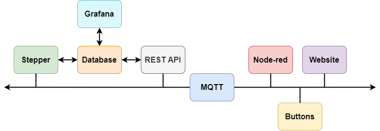

# Desk-as-a-Service
A manual stand-up desk that has been re-engineered into an electronically controlled one

# TO DO
- figure out how to manage passwords
- figure out how to best setup database configuration each time
- when to have volumes? when to copy everything over from files?
- best way to do development inside containers? how to ssh into?
- setup github actions as that'd be cool
<<<<<<< HEAD
- create ssh identity file
=======

- get sheet metal designed for desk support (and find supplier)
>>>>>>> 62390935ee652c503bf5796114ca8247f4829260

# Architecture 

# Development 
`ssh -NL localhost:45312:/var/run/docker.sock pi@desk`
`bcdedit /set hypervisorlaunchtype auto`